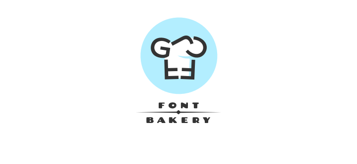

# 

Font Bakery is a command-line tool for checking the quality of font projects. 
It currently comes with checks for OpenType files, at 3 levels: 
Format specifications, distributor requirements, and custom checks. 

The project was initiated by Dave Crossland in 2013 to accelerate the onboarding process for Google Fonts. 
In 2017 Lasse Fister rewrote it into a modern, modular architecture suitable for both individuals and large distributors. 
He also began a sister project, [Font Bakery Dashboard](https://GitHub.com/GoogleFonts/Fontbakery-Dashboard):
A UI and a cloud system that scales up for checking 1,000s of font files super fast and in parallel, by using 1,000s of "container" virtual machines. See his [TypoLabs 2018 talk on YouTube](https://www.youtube.com/watch?v=Kqhzg89zKYw).

Font Bakery has an active community of contributors from foundries around the world, including Adobe Typekit, Dalton Maag, Google Fonts and Type Network.

Most of the checks are for OpenType binary files, and project metadata files. 
(Currently, the Google Fonts `METADATA.pb` files are supported.)

To learn more about writing custom checks, see [docs/writing-specifications.md](https://github.com/googlefonts/fontbakery/blob/master/docs/writing-specifications.md)

If you are developing a font project publicly with Github (or a similar host) you can set up a Continuous Integration service (like [Travis](https://www.travis-ci.org)) to run Font Bakery on each commit, so that with each update all checks will be run on your files.

Font Bakery is not an official Google project, and Google provides no support for it.
However, throughout 2018 the project maintainers Felipe Corrêa da Silva Sanches <juca@members.fsf.org> and Lasse Fister <commander@graphicore.de> were funded by the Google Fonts team.

Font Bakery is available under the Apache 2.0 license.

## Install

See [INSTALL.md](https://github.com/googlefonts/fontbakery/blob/master/INSTALL.md)

## Web Usage

A web dashboard for monitoring check-results of project collections is at <https://github.com/googlefonts/fontbakery-dashboard>

## Command Line Usage

Install Font Bakery as a package, following the [installation instructions](https://github.com/googlefonts/fontbakery#install) below, and you will have a `fontbakery` command in your `$PATH`.

This has several subcommands, described in the help function:

    $ fontbakery -h
    usage: fontbakery [-h] [--list-subcommands] subcommand
    
    Run fontbakery subcommands:
        build-contributors
        check-collection
        check-googlefonts
        check-noto-version
        check-specification
        generate-glyphdata
    
    Subcommands have their own help messages. These are usually 
    accessible with the -h/--help flag positioned after the subcommand.
    I.e.: fontbakery subcommand -h
    
    positional arguments:
      subcommand          the subcommand to execute
    
    optional arguments:
      -h, --help          show this help message and exit
      --list-subcommands  print the list of subcommnds to stdout, separated 
                          by a space character. This is usually only used to 
                          generate the shell completion code.

### fontbakery check-googlefonts

This is the command used by foundries checking their projects for Google Fonts 

It runs the checks that we use  <https://github.com/google/fonts>`specifications/googlefonts.py`

To run the checks on some fonts:

    $ cd ~/path/to/fontproject/
    $ fontbakery check-googlefonts *.ttf

For more detailed output, run in verbose mode:

    $ fontbakery check-googlefonts --verbose *.ttf

To save a json formatted report (where check results are saved to `report.json`) do:

    $ fontbakery check-googlefonts --json report.json *.ttf

Run hand picked checks for all fonts in the `google/fonts` repository:

    $ fontbakery check-googlefonts \
        -c com.google.fonts/check/034 \
        -c com.google.fonts/check/044 \
        -n -o "*check" -g "*check" \
        path/to/fonts/{apache,ofl,ufl}/*/*.ttf

* `-c` selects a check by id
* `-n` turns off the progress bar
* `-o "*check"` change execution order to run each check for all fonts instead of all checks for each font.
* `-g "*check"` creates a summary report per check

Here's the output of `fontbakery check-googlefonts -h`:

    $ fontbakery check-googlefonts -h
    usage: fontbakery-check-googlefonts.py [-h] [-c CHECKID] [-v] [-l LOGLEVEL]
                                           [-m LOGLEVEL_MESSAGES] [-n] [-C]
                                           [--json JSON_FILE] [-g ITERATED_ARG]
                                           [-o ORDER]
                                           arg_filepaths [arg_filepaths ...]

    Check TTF files for common issues.

    positional arguments:
      arg_filepaths         font file path(s) to check. Wildcards like *.ttf are allowed.

    optional arguments:
      -h, --help            show this help message and exit
      -c CHECKID, --checkid CHECKID
                            Explicit check-ids to be executed.
                            Use this option multiple times to select multiple checks.
      -v, --verbose         Shortcut for `-l PASS`.
      -l LOGLEVEL, --loglevel LOGLEVEL
                            Report checks with a result of this status or higher.
                            One of: DEBUG, PASS, INFO, SKIP, WARN, FAIL, ERROR.
                            (default: WARN)
      -m LOGLEVEL_MESSAGES, --loglevel-messages LOGLEVEL_MESSAGES
                            Report log messages of this status or higher.
                            Messages are all status lines within a check.
                            One of: DEBUG, PASS, INFO, SKIP, WARN, FAIL, ERROR.
                            (default: LOGLEVEL)
      -n, --no-progress     In a tty as stdout, don't render the progress indicators.
      -C, --no-colors       No colors for tty output
      --json JSON_FILE      Write a json formatted report to JSON_FILE.
      -g ITERATED_ARG, --gather-by ITERATED_ARG
                            Optional: collect results by ITERATED_ARG
                            In terminal output: create a summary counter for each ITERATED_ARG.
                            In json output: structure the document by ITERATED_ARG.
                            One of: font, *check
      -o ORDER, --order ORDER
                            Comma separated list of order arguments.
                            The execution order is determined by the order of the check
                            definitions and by the order of the iterable arguments.
                            A section defines its own order. `--order` can be used to
                            override the order of *all* sections.
                            Despite the ITERATED_ARGS there are two special
                            values available:
                            "*iterargs" -- all remainig ITERATED_ARGS
                            "*check"     -- order by check
                            ITERATED_ARGS: font
                            A sections default is equivalent to: "*iterargs, *check".
                            A common use case is `-o "*check"` when checking the whole
                            collection against a selection of checks picked with `--checkid`.

Note: on Windows, color and progress bar output is disabled because the standard Windows terminal displays the escape characters instead. Pull Requests to fix this are welcome.

If you need to generate a list of all issues in a font family collection, such as the Google Fonts collection, checkout that repo and then run:

    sh bin/fontbakery-check-collection.sh path-to-collection-directory

This will create a folder called `check_results/` then run the `check-googlefonts` subcommand on every family, saving individual per-family reports in json format into subdirectories.

#### Bash completion

See [docs/bash-completion.md](https://github.com/googlefonts/fontbakery/blob/davelab6-docs/docs/bash-completion.md)

#### Old Command Line Tools

Since November 2017 (v0.3.3) Font Bakery is solely focused checking fonts.
Before that (up to v0.3.2) it also provided some auxiliary scripts for fixing fonts. 

Those tools are now a separate project, Google Fonts Tools, maintained at <https://github.com/googlefonts/tools> and packaged at <https://pypi.python.org/pypi/gftools>

Installing the latest version of the auxiliary scripts should be as easy as:

    pip install gftools --upgrade
